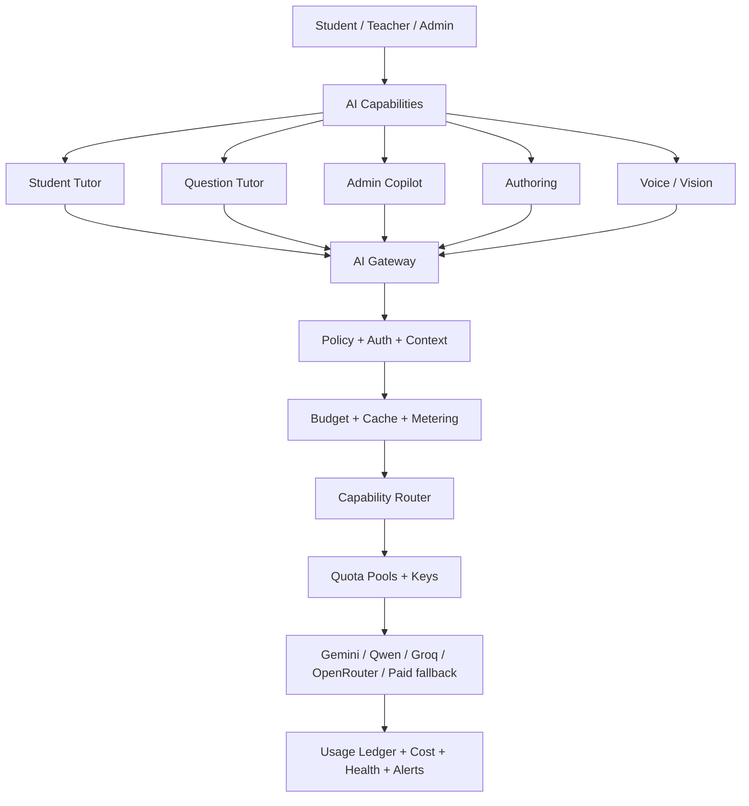

# ALMEAA — خطة تنفيذ منصة الذكاء الاصطناعي الموحدة

> التاريخ: 2026-09-24  
> الحالة: **ACTIVE EXECUTION PLAN**  
> المرجع المعماري: `AI_PLATFORM_OPERATING_MODEL_AR.md`  
> قاعدة التنفيذ: تطوير تدريجي، لا إعادة بناء، لا مفاتيح في Frontend، ولا Production deploy قبل Exact-head Green.

## الهدف

تحويل الموجود حاليًا من وظائف AI تعمل بالفعل لكنها موزعة بين `ai.routes.ts` و`Platform Integrations` و`AiAssistantManager` إلى **AI Domain واحد** قابل للتوسع، قليل التكلفة، قليل الحمل على السيرفر، ومفهوم لأي مطور أو Agent.

## الخريطة



## مراحل التنفيذ

| المرحلة | الحالة | الناتج |
|---|---|---|
| AI-0 Canonicalize | ✅ CLOSED | مرجع موحد + جرد المشروع + Reference Center |
| AI-1 Secure Gateway | 🟡 IN PROGRESS | إغلاق تسريب التكلفة + توحيد budget/logging + local-provider truth |
| AI-2 Usage & Cost | ⏳ NEXT | token ledger + cost + retention + counters |
| AI-3 Quota Pools & Routing | ⏳ | أكثر من Project/Key + Free-first + capability profiles |
| AI-4 Control Center | ⏳ | نقل إدارة AI من Integrations إلى شاشة واحدة احترافية |
| AI-5 Tutor Sessions | ⏳ | Student/Question tutor context/session memory المحدودة |
| AI-6 Voice & Vision | ⏳ | push-to-talk + STT/TTS budgets + vision on demand |
| AI-7 Readiness & Prediction | ⏳ | readiness deterministic + predicted score بعد calibration |
| AI-8 Production Certification | ⏳ | load/cost/security/fallback exact-head evidence |

## AI-1 — Secure Gateway

### الهدف
قبل إدخال أي مفتاح مجاني أو مدفوع، لا يوجد endpoint يستطيع استنزاف الحصة بلا Budget أو Logging.

### التنفيذ
- [x] Capability Policy مستقلة داخل `server/src/modules/ai/application`.
- [x] عدم اعتبار Ollama/LM Studio configured من default values فقط.
- [x] Guest Chat يستخدم fallback داخلي افتراضيًا.
- [x] حد لحجم صورة Chat قبل Vision.
- [x] `runBudgetedAiRequest` كمسار مشترك للـAI calls العامة.
- [x] study-plan داخل budget/ledger.
- [x] learning-path داخل budget/ledger.
- [x] remediation-plan داخل budget/ledger.
- [x] question authoring داخل budget/ledger.
- [x] course-summary محمي من الاستهلاك العام وداخل budget/ledger.
- [x] مدخل الإدارة أصبح «إدارة الذكاء الاصطناعي».
- [ ] استخراج provider adapters من `ai.routes.ts`.
- [ ] config cache قصير بدل Mongo read لكل request.
- [ ] Exact-head typecheck/build/smokes.

### Gate
AI-1 لا يغلق إلا إذا:
- Frontend typecheck/build Green.
- Backend typecheck/build Green.
- `smoke:ai-config-bridge` Green.
- `smoke:ai-platform-phase1` Green.
- AI security/scope contracts Green.
- لا endpoint عام ينفق external AI افتراضيًا.
- Production status لا يعلن local provider جاهزًا من defaults فقط.

## AI-2 — Usage / Tokens / Cost

- normalized usage: input/output/total tokens، estimated flag، provider/model/capability، latency/cost/cache/fallback.
- provider usage adapters للاستفادة من usage الحقيقي عندما يرجعه المزود.
- daily counters بدل `countDocuments` المتكرر.
- Redis counters إن كان Redis متاحًا؛ Mongo daily bucket fallback.
- retention لسجل التفاعلات التفصيلي + daily rollups.
- Spend caps: global / school / user / capability / paid provider.
- الوضع الافتراضي: **Free First + Hard Spend Cap**.

## AI-3 — Quota Pools / Multi-Key / Free-First

```
Provider
  └── Account / Organization
      └── Project / Workspace = Quota Pool
          ├── Key 1
          └── Key 2
```

- المفاتيح داخل نفس quota pool ليست حصصًا مستقلة.
- Key failover لأخطاء credential/health.
- Quota failover ينتقل إلى Pool آخر أو Provider آخر.
- دعم Gemini Projects متعددة بطريقة مشروعة.
- دعم Qwen/Groq/OpenRouter وغيرها عبر adapters.
- Free-only pools.
- paidAllowed flag.
- monthly spend cap.

## AI-4 — AI Control Center

نطور الشاشة الحالية `AiAssistantManager` بدل إنشاء إدارة ثالثة:

1. Overview.
2. Assistants.
3. Providers / Accounts / Projects / Keys.
4. Routing / Models.
5. Budgets / Cost.
6. Usage.
7. Logs / Alerts.
8. Test Lab.

`Platform Integrations` يتوقف تدريجيًا عن كونه مكان تحرير AI ويحتفظ بالتكاملات غير AI فقط.

## AI-5 — Tutor Sessions

- Student Tutor وQuestion Tutor يشتركان في Context Gateway.
- لا full history.
- session summary محدودة.
- weak skills قليلة + recent results قليلة.
- no scoring/mastery by LLM.
- روابط مباشرة للدرس/التدريب بدل نصائح عامة فقط.

## AI-6 — Voice / Vision

### Voice
- البداية Push-to-talk.
- STT خارجي اقتصادي.
- Text Tutor نفسه.
- Browser TTS أولًا.
- TTS مدفوع فقط عند الحاجة.
- voice minutes budget.

### Vision
- لا Vision على render.
- imageUrl/R2 لا يمر عبر Node افتراضيًا.
- trusted visualDescription أولًا.
- Vision فقط بطلب واضح وحصة مستقلة.

## AI-7 — Readiness / Predicted Score

- readiness تحسب deterministic من SkillProgress/Attempts.
- AI يشرح النتيجة ولا يحسبها.
- predicted score لا يطلق قبل dataset وcalibration وقياس error.
- يظهر Range وثقة بدل رقم مضلل عند الحاجة.

## AI-8 — Production Certification

يجب إثبات:
- provider failover.
- quota-pool failover.
- invalid/revoked key.
- 429 handling.
- hard spend cap.
- no-AI fallback.
- token/cost accounting.
- cache savings.
- concurrency/load.
- no secret exposure.
- school/user isolation.
- live admin observability.

## قواعد عدم التضخم

1. لا Microservice AI الآن.
2. لا Redis إلزامي؛ optional optimization.
3. لا Collection جديدة لكل مساعد.
4. لا Prompt history غير محدود.
5. لا image copies.
6. لا AI-generated copy من Question.
7. لا provider-specific logic في React.
8. لا تكرار configuration بين env وDB؛ DB admin config أعلى أولوية وenv bootstrap/fallback.
9. لا deployment لكل commit صغير؛ نجمع المرحلة ثم نختبر.
10. أي capability جديدة تدخل عبر Gateway + Budget + Usage + Admin visibility من أول يوم.

## ترتيب التنفيذ الحالي

```
AI-1 P0 guards
→ AI-1 provider extraction/config cache
→ exact-head tests
→ AI-2 token/cost ledger
→ AI-3 quota pools/free-first routing
→ AI-4 unified control center
→ AI-5 tutor sessions
→ AI-6 voice/vision
→ AI-7 readiness/prediction
→ AI-8 certification
```
