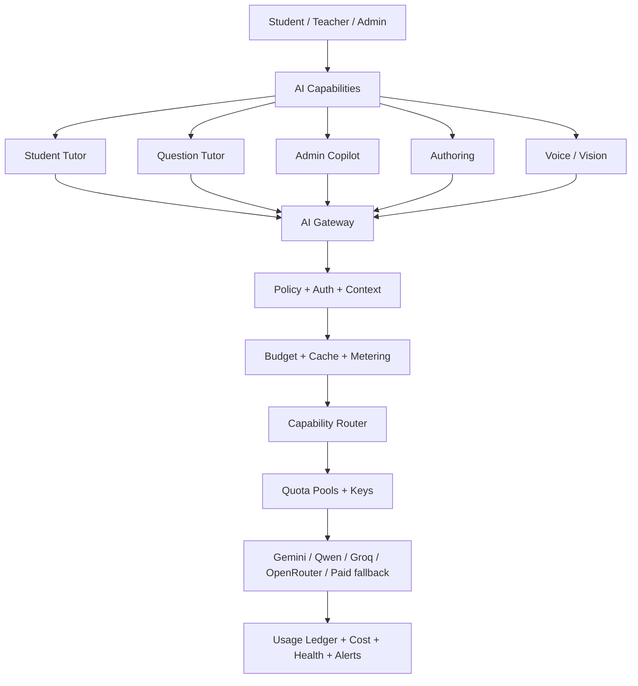

# ALMEAA — خطة تنفيذ منصة الذكاء الاصطناعي الموحدة

> التاريخ: 2026-09-24  
> الحالة: **ACTIVE EXECUTION PLAN**  
> المرجع المعماري: `AI_PLATFORM_OPERATING_MODEL_AR.md`  
> قاعدة التنفيذ: تطوير تدريجي، لا إعادة بناء، لا مفاتيح في Frontend، ولا Production deploy قبل Exact-head Green.

## الهدف

تحويل الموجود حاليًا من وظائف AI تعمل بالفعل لكنها موزعة بين `ai.routes.ts` و`Platform Integrations` و`AiAssistantManager` إلى **AI Domain واحد** قابل للتوسع، قليل التكلفة، قليل الحمل على السيرفر، ومفهوم لأي مطور أو Agent.

## الخريطة



## مراحل التنفيذ

| المرحلة | الحالة | الناتج |
|---|---|---|
| AI-0 Canonicalize | ✅ CLOSED | مرجع موحد + جرد المشروع + Reference Center |
| AI-1 Secure Gateway | ✅ CLOSED | إغلاق تسريب التكلفة + توحيد budget/logging + local-provider truth |
| AI-2 Usage & Cost | ✅ CLOSED | token ledger + cost + retention + counters |
| AI-3 Quota Pools & Routing | ✅ CLOSED | أكثر من Project/Key + Free-first + capability profiles |
| AI-4 Control Center | ✅ CLOSED | نقل إدارة AI من Integrations إلى شاشة واحدة احترافية |
| AI-5 Tutor Sessions | ✅ CLOSED | Student/Question tutor context/session memory المحدودة |
| AI-6 Voice & Vision | ✅ CLOSED (LOW-COST V1) | push-to-talk + STT/TTS budgets + vision on demand |
| AI-7 Readiness & Prediction | 🟡 IN PROGRESS | readiness deterministic + predicted score بعد calibration |
| AI-8 Production Certification | ⏳ | load/cost/security/fallback exact-head evidence |

## AI-1 — Secure Gateway

### الهدف
قبل إدخال أي مفتاح مجاني أو مدفوع، لا يوجد endpoint يستطيع استنزاف الحصة بلا Budget أو Logging.

### التنفيذ
- [x] Capability Policy مستقلة داخل `server/src/modules/ai/application`.
- [x] عدم اعتبار Ollama/LM Studio configured من default values فقط.
- [x] Guest Chat يستخدم fallback داخلي افتراضيًا.
- [x] حد لحجم صورة Chat قبل Vision.
- [x] `runBudgetedAiRequest` كمسار مشترك للـAI calls العامة.
- [x] study-plan داخل budget/ledger.
- [x] learning-path داخل budget/ledger.
- [x] remediation-plan داخل budget/ledger.
- [x] question authoring داخل budget/ledger.
- [x] course-summary محمي من الاستهلاك العام وداخل budget/ledger.
- [x] مدخل الإدارة أصبح «إدارة الذكاء الاصطناعي».
- [x] استخراج provider adapters من `ai.routes.ts`.
- [x] config cache قصير بدل Mongo read لكل request.
- [x] Exact-head typecheck/build/smokes.

### Gate
AI-1 لا يغلق إلا إذا:
- Frontend typecheck/build Green.
- Backend typecheck/build Green.
- `smoke:ai-config-bridge` Green.
- `smoke:ai-platform-phase1` Green.
- AI security/scope contracts Green.
- لا endpoint عام ينفق external AI افتراضيًا.
- Production status لا يعلن local provider جاهزًا من defaults فقط.

## AI-2 — Usage / Tokens / Cost

### الحالة الحالية
- [x] normalized token usage من Gemini/OpenAI-compatible/Ollama/LM Studio عندما يرجعه المزود.
- [x] fallback تقديري معلّم بوضوح `usageEstimated=true` عندما لا يعيد المزود Usage.
- [x] تخزين input/output/total/cached tokens داخل `AiInteraction`.
- [x] تجميع Tokens آخر 24 ساعة في Admin interactions summary.
- [ ] cost estimator/model pricing registry.
- [x] daily indexed usage rollups بدل countDocuments على سجل التفاعلات في كل طلب.
- [x] bootstrap للعداد اليومي من السجل القديم عند أول قراءة فقط.
- [x] retention للـdetail log الجديد 30 يومًا مع بقاء daily rollups.
- [x] pricing hints اختيارية لكل مزود/موديل بدل hardcode أسعار قديمة.
- [x] daily hard spend cap اختياري من `ai-global.note.dailySpendCapUsd`.
- [x] AI-2 Exact-head gates مطلوبة قبل الانتقال إلى AI-3.

- normalized usage: input/output/total tokens، estimated flag، provider/model/capability، latency/cost/cache/fallback.
- provider usage adapters للاستفادة من usage الحقيقي عندما يرجعه المزود.
- daily counters بدل `countDocuments` المتكرر.
- Redis counters إن كان Redis متاحًا؛ Mongo daily bucket fallback.
- retention لسجل التفاعلات التفصيلي + daily rollups.
- Spend caps: global / school / user / capability / paid provider.
- الوضع الافتراضي: **Free First + Hard Spend Cap**.

## AI-3 — Quota Pools / Multi-Key / Free-First

```
Provider
  └── Account / Organization
      └── Project / Workspace = Quota Pool
          ├── Key 1
          └── Key 2
```

- [x] المفاتيح داخل نفس quota pool ليست حصصًا مستقلة.
- [x] Key failover لأخطاء credential/health داخل Pool نفسه.
- [x] 429 على Pool يقفز إلى Pool آخر بدل تدوير مفاتيح تشترك في نفس الحصة.
- [x] Free/Trial pools تسبق Unknown/Paid في Free-First routing.
- [x] status API يعرض metadata آمنة وعدد المفاتيح ولا يعرض الأسرار.
- [x] لوحة الإدارة تعرض عدد الحصص وعدد الحصص المجانية لكل مزود.
- [x] Capability-specific route profiles قابلة للتهيئة من ai-global مع حدود output مستقلة.
- [x] paidAllowed/global paid kill-switch مستقل عن spend cap، ومغلق افتراضيًا.
- [x] UI موحد لإضافة/تعديل Accounts/Projects/Pools داخل AI Control Center.
- دعم Gemini Projects متعددة بطريقة مشروعة.
- دعم Qwen/Groq/OpenRouter وغيرها عبر adapters.
- Free-only pools.
- paidAllowed flag.
- monthly spend cap.

## AI-4 — AI Control Center

نطور الشاشة الحالية `AiAssistantManager` بدل إنشاء إدارة ثالثة.

### الحالة الحالية
- [x] مدخل واحد باسم «إدارة الذكاء الاصطناعي».
- [x] تبويب مباشر للمفاتيح والحصص والتكلفة داخل نفس الإدارة.
- [x] إضافة Accounts / Projects / Quota Pools دون عرض الأسرار بعد الحفظ.
- [x] مفاتيح متعددة داخل Pool واحد مع حفظ مشفر في الخادم.
- [x] Free First + paidAllowed + daily spend cap من نفس الشاشة.
- [x] عرض عدد الحصص والمجانية لكل Provider.
- [x] مساعد المدير، مزودات، Logs، Readiness موجودة في نفس المركز.
- [x] محرر بصري لـCapability route profiles داخل AI Control Center.
- [x] Usage dashboard واضح للتوكنز والتكلفة والـcache والـfallback مع فصل التوجيه حسب Capability.
- [x] Alerts تشغيلية للـfallback/errors/circuit-open وغياب spend cap عند السماح المدفوع.
- [x] Test Lab يختبر كل Quota Pool على حدة، وليس Provider كامل فقط.
- [x] الإدارة اليومية للـAI أصبحت داخل AI Control Center؛ Platform Integrations بقي Backend/compatibility bridge ولا يحتاج المدير فتح شاشته لإدارة AI.

التبويبات المستهدفة نهائيًا:
1. Overview.
2. Assistants.
3. Providers / Accounts / Projects / Keys.
4. Routing / Models.
5. Budgets / Cost.
6. Usage.
7. Logs / Alerts.
8. Test Lab.

`Platform Integrations` يبقى للتكاملات العامة، ويظل AI bridge داخله مؤقتًا فقط لتوافق البيانات القديمة.

## AI-5 — Tutor Sessions

### الحالة الحالية
- [x] Student Tutor وQuestion Tutor يشتركان في Context Gateway واحد.
- [x] لا full history؛ الذاكرة محصورة في آخر 1–2 turns فقط وبحد أقصى 3.
- [x] weak skills محدودة (حتى 6 افتراضيًا) + recent results محدودة (حتى 3 افتراضيًا).
- [x] Question Tutor يعطي أولوية للمهارات المرتبطة بالسؤال نفسه.
- [x] context summary لها حد أقصى واضح ولا تُمرر history خام غير محدود.
- [x] no scoring/mastery by LLM؛ الأرقام مصدرها SkillProgress/QuizResult فقط.
- [x] لا Collection جديدة للمحادثات؛ يتم إعادة استخدام AiInteraction المحدود بالـretention.
- [x] Session memory صريحة: كل Chat/Question Tutor يرسل tutorSessionId، والذاكرة لا تعبر بين جلسات منفصلة.
- [x] cache والـAiInteraction metadata يربطان ردود Question Tutor بالجلسة الحالية.
- [x] روابط مباشرة لمسار التعلم من SkillProgress.pathId تظهر مع الرد المخصص بدون سؤال إضافي للـLLM.
- [x] UI الطالب يوضح «مبني على أدائك» عندما يكون الرد مخصصًا، بدون كشف بيانات داخلية.

## AI-6 — Voice / Vision

### Voice
- [x] Push-to-talk V1 داخل Student Tutor.
- [x] Browser speech recognition عند دعم المتصفح، ويعود لنفس Text Tutor.
- [x] Browser TTS للردود اختياريًا بدون مزود مدفوع.
- [x] لا STT/TTS مدفوع في V1؛ المتصفح هو المسار الافتراضي لتجنب التكلفة.
- [x] أي STT/TTS خارجي لاحقًا يُعامل كتوسعة اختيارية ويستلزم voice-minute budget قبل التفعيل.

### Vision
- [x] Vision أصبح Capability صريحة مستقلة عن student_chat.
- [x] الصورة لا ترسل إلا بعد اختيار الطالب لها صراحة.
- [x] ضغط/تصغير الصورة في المتصفح قبل Node لتقليل bandwidth.
- [x] المسار الحالي يرسل الصورة فقط إلى Gemini adapter الذي يدعمها فعليًا؛ لا fallback صامت إلى مزود نصي.
- [x] Question Tutor يستمر على trusted visualDescription ولا يرسل الصورة افتراضيًا.
- [x] Vision request budget يومي مستقل على مستوى Capability، مع fallback نصي عند بلوغ الحد.

## AI-7 — Readiness / Predicted Score

- [x] readiness تحسب deterministic من SkillProgress/Attempts عبر نفس Mastery Readiness الحالي.
- [x] تقدير أداء داخلي يجمع readiness + آخر قياسات موثوقة، ولا يستخدم LLM.
- [x] لا يظهر التقدير قبل 3 قياسات و30 سؤالًا وحد أدنى من التغطية والأدلة.
- [x] يظهر Range وثقة بدل رقم منفرد مضلل.
- [x] Qiyas score يبقى null وcalibratedToQiyas=false حتى تتوفر بيانات معايرة فعلية.
- [ ] بناء Dataset معايرة من نتائج قياس الفعلية بموافقة المستخدم/الطالب.
- [ ] قياس MAE/Calibration error قبل إطلاق «درجة قياس متوقعة» بالاسم.

## AI-8 — Production Certification

يجب إثبات:
- provider failover.
- quota-pool failover.
- invalid/revoked key.
- 429 handling.
- hard spend cap.
- no-AI fallback.
- token/cost accounting.
- cache savings.
- concurrency/load.
- no secret exposure.
- school/user isolation.
- live admin observability.

## قواعد عدم التضخم

1. لا Microservice AI الآن.
2. لا Redis إلزامي؛ optional optimization.
3. لا Collection جديدة لكل مساعد.
4. لا Prompt history غير محدود.
5. لا image copies.
6. لا AI-generated copy من Question.
7. لا provider-specific logic في React.
8. لا تكرار configuration بين env وDB؛ DB admin config أعلى أولوية وenv bootstrap/fallback.
9. لا deployment لكل commit صغير؛ نجمع المرحلة ثم نختبر.
10. أي capability جديدة تدخل عبر Gateway + Budget + Usage + Admin visibility من أول يوم.

## ترتيب التنفيذ الحالي

```
AI-1 P0 guards
→ AI-1 provider extraction/config cache
→ exact-head tests
→ AI-2 token/cost ledger
→ AI-3 quota pools/free-first routing
→ AI-4 unified control center
→ AI-5 tutor sessions
→ AI-6 voice/vision
→ AI-7 readiness/prediction
→ AI-8 certification
```
