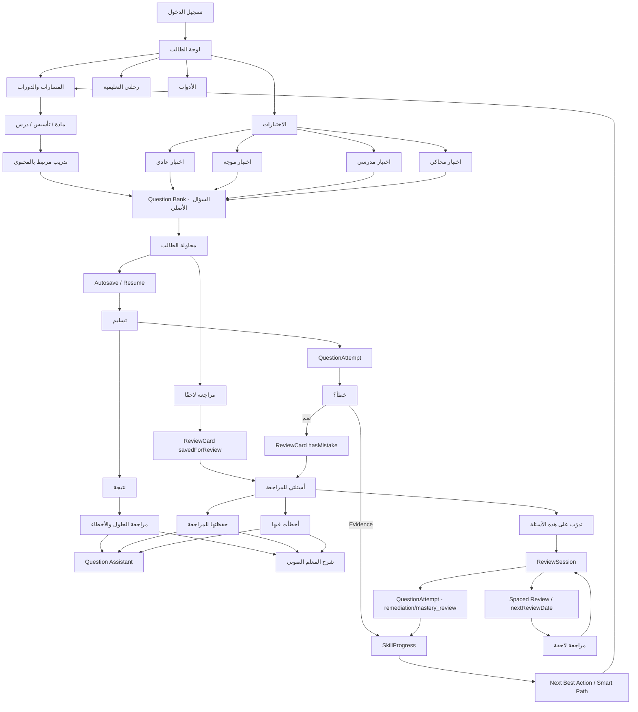

# ALMEAA — فلسفة وخريطة رحلة الطالب

> آخر تحقق تنفيذي: 2026-09-24  
> النطاق: Student Journey + Assessment + Student Review + Smart Tutor + Voice + Remediation + Spaced Review  
> دليل E2E المرجعي: GitHub Actions Run #35956637308 على commit `8375ede708c931e690639f853ed6d8cf8790428c`  
> الحالة: **Deep Pre-Merge E2E Green بالكامل** على بيئة Mongo/Chromium معزولة وبدون أي كتابة على Production.

---

## 1. الفلسفة العامة

رحلة الطالب في ALMEAA ليست مجموعة صفحات منفصلة؛ هي حلقة تعلم واحدة متصلة:

**يتعلم → يتدرّب → يختبر نفسه → يفهم النتيجة → يراجع الخطأ → يتدرّب علاجيًا → تتحدث المهارة → يعود للمراجعة في الوقت المناسب.**

الهدف من الواجهة أن يرى الطالب قرارًا واضحًا واحدًا في كل لحظة، بينما تبقى التفاصيل الثقيلة في الخلفية.

المبادئ الحاكمة:

1. **البساطة أمام الطالب، والقوة في الخلفية.**  
   الطالب لا يحتاج رؤية تعقيد Question Bank أو SkillProgress أو Evidence Types. يحتاج فقط أن يعرف: ماذا أفعل الآن؟

2. **سؤال واحد وهوية واحدة.**  
   القاعدة المعتمدة:  
   **One Question → One Image → One Code → Unlimited Reuse**  
   الاختبار والمراجعة والتدريب لا تنشئ نسخًا جديدة من السؤال أو الصورة، بل تشير إلى السؤال الأصلي بالـID.

3. **Server Truth قبل Local State.**  
   الحفظ للمراجعة، الأخطاء، النتائج، المحاولات والإتقان تعتمد على الخادم، وليس على قائمة IDs محلية قابلة للضياع.

4. **الذكاء الاصطناعي مساعد تعليمي، وليس مصححًا أو محرك درجات.**  
   Question Assistant لا يغير الدرجة ولا الإتقان ولا القرار التكيفي. دوره الشرح والتلميح والنقاش فقط.

5. **كل محاولة دليل تعليمي.**  
   الاختبار والمراجعة العلاجية ومراجعة الإتقان تسجل Evidence يمكن أن يغذي SkillProgress والتحليلات دون تكرار السؤال.

6. **الطالب يدخل في Loop لا في طريق مسدود.**  
   نهاية الاختبار ليست نهاية الرحلة؛ النتيجة تقود إلى مراجعة، والمراجعة تقود إلى تدريب علاجي، ثم إلى قرار التعلم التالي.

---

## 2. الخريطة الكبرى لرحلة الطالب

---

## 3. ماذا يرى الطالب في لوحة الطالب؟

القائمة الحالية مرتبة بحيث تكون الوظائف متجمعة بصريًا بدل قائمة طويلة بلا معنى.

### المدخل الأساسي
- **نظرة عامة**: نقطة البداية السريعة.
- **مساراتي**: المسارات التعليمية المسجل فيها الطالب.
- **دوراتي**: المحتوى الذي يمتلكه أو تم منحه له.
- **جلساتي**: الجلسات المرتبطة بالطالب.

### رحلتي التعليمية
- **المسار الذكي**: توجيه مبني على مستوى المهارات.
- **خططي**: الخطط الدراسية/التعلمية.
- **تقاريري**: فهم الأداء والمهارات.

### الاختبارات
- **الاختبارات السابقة**.
- **الاختبارات المدرسية**.
- **الاختبارات المحاكية**.
- الاختبارات الموجهة تظهر للطالب المستهدف فقط وفق الصلاحيات والربط.

### الأدوات
- **أسئلتي للمراجعة**.
- **بطاقات التذكر**.

### الدعم
- **سؤال وجواب**.
- **طلباتي**.

في دفعة الإغلاق الحالية تم أيضًا توحيد لون **أسئلتي للمراجعة** مع مجموعة «الأدوات» بصريًا حتى لا تبدو كعنصر خارج المجموعة.

---

## 4. رحلة التعلم قبل الاختبار

الفكرة أن الطالب لا ينتقل بين صفحات عشوائية. المسار الطبيعي هو:

**مسار → مادة → موضوع → درس → تدريب → تقييم.**

المحتوى يظهر بحسب الربط داخل Learning Space، وليس لأن العنصر موجود فقط في المستودع.  
الدرس أو التدريب يجب أن يحافظ على سياق العودة، بحيث يرجع الطالب إلى المكان الذي بدأ منه بدل أن يفقد موقعه في الرحلة.

المرجع التفصيلي القديم لهذه الجزئية:
`docs/STUDENT_JOURNEY_AND_TESTS_PLAN_AR.md`.

---

## 5. رحلة الاختبار

الاختبار يستخدم الأسئلة من Question Bank بالمرجع، ولا ينسخ كيان Question.

### أثناء الحل
- الطالب يرى السؤال والاختيارات.
- الإجابة تحفظ تدريجيًا.
- توجد Session قابلة للاستكمال.
- retry لنفس progress لا ينشئ Attempt جديدًا بلا داعٍ.
- يمكن للطالب استخدام **مراجعة لاحقًا** لحفظ السؤال في مكتبته الشخصية للمراجعة.
- الحل الصحيح لا يُكشف قبل التسليم.

### عند التسليم
- تنتهي Session القابلة للاستكمال.
- ينشأ Result على الخادم.
- تحفظ أدلة المحاولة.
- الأخطاء يمكن أن تنتج ReviewCard من نوع استعادة خطأ.
- SkillProgress يستفيد من الأدلة المرتبطة بالمهارات.

### الأنواع
نفس البنية تدعم:
- اختبار عادي.
- اختبار موجه.
- اختبار مدرسي.
- اختبار محاكي متعدد الأقسام.

---

## 6. النتيجة ليست مجرد درجة

بعد التسليم، الطالب ينتقل إلى **نتيجة مفهومة** ثم يستطيع فتح:

**مراجعة الحلول والأخطاء**

داخل مراجعة الحل:
- نفس هوية السؤال.
- اختيار الطالب.
- الإجابة الصحيحة وفق سياق النتيجة المصرح به.
- الشرح الموثوق.
- المعلم الذكي.
- شرح المعلم الصوتي إذا كان موجودًا.

المبدأ: النتيجة تجيب عن سؤالين:
1. ماذا حدث؟
2. ماذا أفعل بعد ذلك؟

---

## 7. «أسئلتي للمراجعة»

هذه ليست Favorites تقليدية. هي ذاكرة تعلم شخصية مرتبطة بالسؤال الأصلي.

يوجد تبويبان أساسيان فقط:

### حفظتها للمراجعة
الطالب يضغط **مراجعة لاحقًا** أثناء الاختبار أو السياق المسموح.  
الخادم ينشئ/يحدث ReviewCard مرتبطًا بـ:
- userId
- questionId
- savedForReview
- savedAt

ولا ينشئ نسخة Question أو نسخة Image.

### أخطأت فيها
تدخل تلقائيًا نتيجة المحاولات الخاطئة.  
ReviewCard يحمل:
- hasMistake
- reviewType = error_recovery عند الحاجة

إذا اجتمع السببان في نفس السؤال، يبقى السؤال كيانًا واحدًا وعلاقة ReviewCard واحدة.

### العرض
الصفحة تعرض:
- عداد لكل تبويب.
- السؤال الأصلي.
- الصورة الأصلية إن وجدت.
- إظهار/إخفاء الحل.
- علامة «محفوظ للمراجعة».
- علامة «خطأ سابق».
- إزالة من المحفوظة دون حذف أثر الخطأ.
- المعلم الصوتي.
- Question Assistant.
- زر **تدرّب على هذه الأسئلة**.

---

## 8. المعلم الذكي داخل السؤال

Question Assistant مكوّن واحد reusable يعمل حسب السياق:

- `result_review`
- `saved_review`
- `mistake_review`
- `mastery_review`

الأوامر الحالية:
- **تلميح**
- **تلميح أقوى**
- **اشرح الفكرة**
- **خطوات الحل**
- Follow-up حر من الطالب

### قواعد الأمان والتكلفة
- لا يعمل إلا عند ضغط الطالب.
- لا يغير الدرجة أو الإتقان.
- يعتمد أولًا على البيانات الموثوقة: hint / solvingStrategy / explanation / voiceExplanation / aiContext.
- الصورة نفسها لا تُرسل لمزود AI افتراضيًا.
- في سياقات saved/mistake لا يُمرر correctOptionIndex للمساعد.
- توجد cache + in-flight dedupe + rate/budget limits.
- في بيئة E2E الحالية `AI_PROVIDER=none`، لذلك الاختبار يثبت مسار الصلاحيات والـfallback الموثوق، وليس مزود AI خارجي حقيقي.

### إصلاح تم اكتشافه أثناء الإغلاق
كان UI الخاص بـQuestionAssistantPanel يشترط `resultId` حتى في saved/mistake review، رغم أن الخادم يدعم هذه السياقات.  
تم إصلاح guard بحيث يصبح `resultId` إلزاميًا فقط في `result_review`.  
ثم تم توسيع E2E للتأكد أن المساعد يعمل فعليًا من:
- نتيجة الاختبار.
- سؤال محفوظ للمراجعة.
- سؤال أخطأ فيه الطالب.

---

## 9. شرح المعلم الصوتي

`QuestionVoiceExplanationPlayer` يستخدم نفس السؤال.

إذا وُجد `audioUrl`:
- يشغّل التسجيل المعتمد.

إذا لم يوجد تسجيل ووجد نص:
- يستخدم SpeechSynthesis باللغة `ar-SA`.

الهدف هو عدم إنشاء خدمة AI صوتية باهظة لمجرد قراءة نص ثابت؛ النص اليدوي الموثوق يمكن قراءته محليًا في المتصفح.

---

## 10. التدريب العلاجي بعد الخطأ

من «أسئلتي للمراجعة» ينتقل الطالب إلى:

`/review?mode=saved` أو `/review?mode=mistakes`

ReviewSession:
- يستدعي نفس questionId.
- لا ينشئ Quiz جديدًا فقط لكي يراجع الطالب سؤالًا.
- يعرض نوع المراجعة:
  - محفوظ للمراجعة.
  - استعادة خطأ.
  - تثبيت إتقان.
- الطالب يجيب من جديد.
- النتيجة تسجل عبر `POST /review/:cardId/answer`.
- يوجد `eventId` لمنع التكرار غير المقصود.
- تنفذ خوارزمية SM-2 لتحديد `nextReviewDate`.
- إذا كانت المحاولة سؤالًا فعليًا، ينشأ QuestionAttempt جديد.
- evidenceType يكون:
  - `remediation` للمحفوظ/الخطأ.
  - `mastery_review` لتحديات تثبيت الإتقان.
- مسار الخادم يستدعي `updateSkillProgressFromQuestionAttempt`.

---

## 11. كيف تتصل طبقات البيانات دون تضخم؟

| الطبقة | وظيفتها | ما الذي لا تفعله |
|---|---|---|
| Question | الحقيقة الأساسية للسؤال + questionCode + imageUrl + AI/voice context | لا تتكرر لكل اختبار |
| Quiz | تعريف الاختبار + questionIds | لا يخزن نسخة Question كاملة |
| QuizResult | نتيجة محاولة الطالب + answer review اللازمة تاريخيًا | لا يصبح Question Bank جديدًا |
| ReviewCard | علاقة الطالب بالسؤال وحالة المراجعة/SM-2 | لا يخزن نسخة صورة أو سؤال |
| QuestionAttempt | دليل محاولة على questionId | لا ينشئ سؤالًا جديدًا |
| SkillProgress | تجميع أدلة المهارة والإتقان | لا يحتفظ بتاريخ غير محدود |
| Question Assistant | مساعدة تعليمية مرتبطة بالسؤال والسياق | لا يحسب score/mastery |
| Voice Explanation | شرح صوتي/نصي مرتبط بالسؤال | لا يكرر السؤال |

### أهم ضمان
`ReviewCard` عليه unique index:
`(userId, questionId)`

لذلك الطالب لا يحصل على نسخ ReviewCard متعددة لنفس السؤال لمجرد أن له أكثر من سبب للمراجعة.

---

## 12. الحلقة التكيفية

الرحلة التعليمية لا تعتمد على «درجة اختبار واحدة».

`QuestionAttempt` → `SkillProgress` → `Readiness / Next Best Action`

SkillProgress يحتفظ بعناصر مثل:
- mastery
- status
- attempts
- evidenceCount
- recentEvidence المحدود
- lastAttemptAt
- recommendedAction

ثم يمكن للمسار الذكي استخدام هذه الإشارات لتحديد الخطوة التالية، بينما يظل AI خارج حساب الدرجة نفسه.

---

## 13. ما الذي تم إثباته فعليًا في E2E؟

المرجع:
**Platform V3 Deep Pre-Merge E2E Gate — Run #35956637308**

| السيناريو | الحالة |
|---|---|
| Frontend typecheck | ✅ |
| API typecheck | ✅ |
| Frontend production build | ✅ |
| API production build | ✅ |
| Mongo معزولة + مستخدمون مؤقتون | ✅ |
| تشغيل API والواجهة من نفس branch | ✅ |
| اختبار موجه منشور يظهر للطالب المستهدف | ✅ |
| دخول الطالب للاختبار | ✅ |
| Autosave لأول وثاني إجابة | ✅ |
| retry/resume يحافظ على Attempt واحد | ✅ |
| زر «مراجعة لاحقًا» يرسل PUT ناجحًا | ✅ |
| السؤال المحفوظ يظهر في saved library | ✅ |
| السؤال الخاطئ يظهر في mistakes library | ✅ |
| canonical questionId محفوظ في الحالتين | ✅ |
| questionCode موجود من نفس Question | ✅ |
| تسليم الاختبار يغلق session | ✅ |
| Result موجود على الخادم | ✅ |
| فتح «مراجعة الحلول والأخطاء» | ✅ |
| ظهور Question Assistant في النتيجة | ✅ |
| استدعاء «تلميح» من result review | ✅ |
| ظهور «شرح المعلم الصوتي» | ✅ |
| فتح «أسئلتي للمراجعة» | ✅ |
| تبويب «حفظتها للمراجعة» | ✅ |
| Question Assistant يعمل من saved_review | ✅ |
| تبويب «أخطأت فيها» + «خطأ سابق» | ✅ |
| Question Assistant يعمل من mistake_review | ✅ |
| فتح تدريب mistakes | ✅ |
| حل السؤال العلاجي بإجابة صحيحة | ✅ |
| تسجيل remediation attempt | ✅ |
| إعادة جدولة السؤال وعدم بقائه due فورًا | ✅ |
| منع مستخدم خارج الاستهداف من فتح الاختبار مباشرة | ✅ |
| Deep suite gate النهائي | ✅ |

كما نجحت في نفس commit:
- Phase + Handover Gate.
- Backend Integration Gate.
- Recovery Gate.
- Refactor V2 Safety Gate.
- Public UI Gate.

---

## 14. ما الذي لم يتم إثباته بهذه الجولة؟

يجب الفصل بين «موجود في الكود» و«شوهد في E2E الحالي».

### غير مثبت في هذه الجولة كواقع Production
- بيانات طلاب حقيقية؛ البيئة كلها Test fixtures.
- كتابة أو قراءة من Production Mongo/Atlas.
- نشر Vercel/Render.
- مزود AI خارجي حقيقي؛ `AI_PROVIDER=none` في E2E.
- جودة صوت مسموع فعلية في جهاز حقيقي؛ الاختبار يثبت ظهور مكون الصوت ومساره، لا جودة السماعة.
- تحميل صورة سؤال حقيقية من R2/CDN في هذه الرحلة؛ fixture المستخدم في هذا الاختبار بلا imageUrl حقيقي.
- قياس bandwidth حقيقي على CDN.
- قياس تكلفة tokens مع مزود خارجي.
- فحص بصري يدوي لكل مقاس هاتف موجود في السوق.

### SkillProgress
المسار التنفيذي في `review.routes.ts` ينشئ QuestionAttempt ثم يستدعي `updateSkillProgressFromQuestionAttempt`.  
الجولة الحالية أثبتت أن POST للمراجعة العلاجية نجح وأن spaced review أعاد الجدولة.  
لكنها **لم تنفذ استعلام DB مباشرًا بعد العملية لإثبات قيمة SkillProgress row بعينها داخل نفس UI journey**؛ تحديث SkillProgress له عقود واختبارات مستقلة داخل المنصة. لذلك لا نبالغ في وصف هذه النقطة.

---

## 15. فلسفة الواجهة

الطالب المستهدف غالبًا يريد قرارًا سريعًا، لذلك:

- لا نعرض نصًا طويلًا افتراضيًا.
- الأزرار الأساسية واضحة وبأسماء أفعال.
- المراجعة فيها تبويبان فقط.
- «المعلم الذكي» يظهر داخل سياق السؤال وليس كمنظومة منفصلة تشتت الطالب.
- الصوت يظهر كزر مباشر.
- التدريب العلاجي لا يطلب من الطالب إعداد Quiz جديد.
- الألوان تستخدم لتقسيم مجموعات القائمة، لا للزينة فقط.
- الصفحة يجب أن تظل مفهومة على الموبايل قبل سطح المكتب.

قاعدة التصميم:
> في كل شاشة، الطالب يجب أن يفهم خلال ثوانٍ: أين أنا؟ ماذا حدث؟ وما الخطوة التالية؟

---

## 16. ملفات الحقيقة المهمة للمطور أو المساعد القادم

ابدأ من هذه الملفات قبل أي تعديل:

- `pages/Dashboard.tsx` — خريطة لوحة الطالب والقائمة.
- `pages/Favorites.tsx` — أسئلتي للمراجعة.
- `pages/ReviewSession.tsx` — التدريب العلاجي/المتباعد.
- `components/results/QuestionAssistantPanel.tsx` — المعلم الذكي داخل السؤال.
- `components/results/QuestionVoiceExplanationPlayer.tsx` — الشرح الصوتي.
- `server/src/modules/quizzes/http/studentReviewRoutes.ts` — saved/mistakes server truth.
- `server/src/routes/review.routes.ts` — due/answer/SM-2/QuestionAttempt.
- `server/src/routes/ai.routes.ts` — authorization + AI gateway للسؤال.
- `server/src/models/ReviewCard.ts`.
- `server/src/models/QuestionAttempt.ts`.
- `server/src/models/SkillProgress.ts`.
- `server/src/modules/quizzes/application/quizSubmissionSkillProgress.ts`.
- `scripts/live-assessment-commercial-audit.mjs` — E2E المرجعي للرحلة.
- `docs/architecture/QUESTION_REVIEW_SMART_TUTOR_REFERENCE_AR.md` — مرجع السؤال الموحد والمراجعة والمعلم الذكي.

---

## 17. قواعد لا يجوز كسرها في التطوير القادم

1. لا تنشئ Question جديدًا لأن السؤال دخل اختبارًا جديدًا.
2. لا ترفع صورة جديدة لأن السؤال أعيد استخدامه.
3. لا تعيد بناء Review System ثالث.
4. لا تستخدم AI في scoring أو mastery calculation.
5. لا تكشف correct answer في سياق اختبار نشط.
6. لا تسمح للـAI بمناقشة سؤال لا يملكه الطالب في Result/Review context المصرح.
7. لا تعتمد على Local Storage كحقيقة نهائية للمراجعة.
8. لا تسمح بتراكم history غير محدود في SkillProgress.
9. لا تعمل Vision على كل سؤال بصورة تلقائية.
10. لا تعمل Deploy Production لمجرد اختبار UI/CI.
11. أي تغيير في رحلة الطالب يمر على E2E من منظور الطالب، لا على API وحدها.
12. إذا تغيرت الفلسفة، حدث هذه الوثيقة بدل ترك مطور جديد يستنتجها من الكود.

---

## 18. الخلاصة التنفيذية

رحلة الطالب المعتمدة حاليًا هي:

**لوحة بسيطة → محتوى/اختبار واضح → سؤال موحد → محاولة محفوظة → نتيجة مفهومة → مراجعة الحلول → حفظ/خطأ في مكتبة مراجعة واحدة → معلم ذكي وصوتي داخل نفس السؤال → تدريب علاجي قصير → QuestionAttempt جديد → تحديث تعليمـي/جدولة مراجعة → عودة للمسار الذكي والتعلم التالي.**

هذه الفلسفة تعطي الطالب تجربة بسيطة، وفي الوقت نفسه تحافظ على:
- هوية السؤال.
- جودة التحليلات.
- قلة التخزين.
- قلة الباندويث.
- قلة استهلاك AI.
- قابلية التوسع.
- وضوح التطوير لأي فريق أو مساعد جديد.
