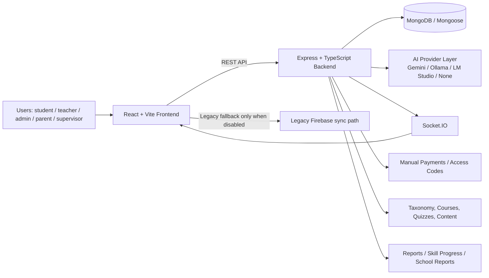

# Technical Architecture

## Tech stack
### Frontend
- React 19
- Vite
- TypeScript
- React Router
- Zustand
- Motion
- Lucide React
- Recharts
- React Quill New
- KaTeX
- React Player
- XLSX

### Backend
- Node.js
- Express
- TypeScript
- Mongoose
- MongoDB driver via Mongoose
- JWT
- bcryptjs
- socket.io
- zod

## Frontend framework
The frontend is a Vite-based React application using `HashRouter` in `App.tsx`.  
It loads many pages lazily and uses a shared layout system.

## Backend framework
The backend is an Express application under `server/src/`.  
Entry point:
- `server/src/server.ts`

App bootstrap:
- `server/src/app.ts`

## Database
- MongoDB
- Mongoose models in `server/src/models/*`
- Local MongoDB support is documented in `README.md`
- Atlas-style connection string is supported via `MONGODB_URI`

## Authentication system
- JWT-based auth
- Password hashing with `bcryptjs`
- Session persistence on the client side
- `auth/me` endpoint for current user state
- Optional dev-only local admin bypass in `server/src/config/env.ts` and `server/src/middleware/auth.ts`

## Authorization / roles / permissions
Roles:
- student
- teacher
- admin
- supervisor
- parent

Authorization is enforced through:
- `requireAuth`
- `optionalAuth`
- `requireRole`
- role-based filtering for staff vs learner visibility

## API structure
Base route:
- `/api`

Route groups:
- `/api/health`
- `/api/auth`
- `/api/taxonomy`
- `/api/content`
- `/api/courses`
- `/api/quizzes`
- `/api/payments`
- `/api/ai`

Client API calls are wrapped in:
- `services/api.ts`

Legacy backend-to-frontend mapping and fallback logic exist in:
- `services/adapter.ts`

## File storage
No dedicated storage provider was clearly confirmed in the inspected repository.  
Observed behavior suggests the platform currently stores and serves file URLs, but a formal storage integration was not clearly visible.

## Payment integrations
No direct third-party payment gateway was clearly confirmed.  
The repository supports:
- payment settings
- payment requests
- manual review
- purchase application after review

## Email/SMS/notification integrations
No clear email, SMS, or push notification provider was confirmed in the inspected repository.

## AI integrations
The backend exposes AI endpoints and supports multiple providers:
- Gemini
- Ollama
- LM Studio
- disabled mode (`none`)

AI is intentionally routed through the backend, not directly from the frontend.

Relevant files:
- `server/src/routes/ai.routes.ts`
- `server/src/config/env.ts`
- `README.md`

## Deployment structure
Deployment manifests were not clearly visible in the inspected repository.  
What is clearly visible:
- frontend build via Vite
- backend build via TypeScript compiler
- server start via `node dist/server.js`

## Environment variables
Documented variables visible in the repository:

### Root / frontend
- `VITE_USE_REAL_API` - switches between real backend API and legacy fallback behavior
- `VITE_API_URL` - base URL for the backend API

### Backend
- `PORT` - backend listening port
- `CLIENT_URL` - allowed frontend origin for CORS
- `MONGODB_URI` - MongoDB connection string
- `JWT_SECRET` - JWT signing secret
- `JWT_EXPIRES_IN` - JWT expiry time
- `DEV_LOCAL_ADMIN_BYPASS` - development-only admin bypass
- `ADMIN_NAME` - bootstrap admin name
- `ADMIN_EMAIL` - bootstrap admin email
- `ADMIN_PASSWORD` - bootstrap admin password
- `AI_PROVIDER` - `gemini`, `ollama`, `lmstudio`, or `none`
- `AI_REQUEST_TIMEOUT_MS` - timeout for AI calls
- `GEMINI_API_KEY` - Gemini key
- `GEMINI_MODEL` - Gemini model name
- `OLLAMA_BASE_URL` - Ollama endpoint
- `OLLAMA_MODEL` - Ollama model name
- `LM_STUDIO_BASE_URL` - LM Studio compatible base URL
- `LM_STUDIO_MODEL` - LM Studio model name

## High-level architecture diagram

