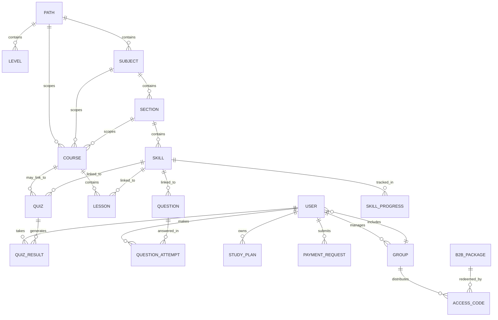

# Database and Data Model

## Database type
- MongoDB
- Mongoose is the ORM/ODM layer

## Main entities
| Entity | Purpose | Key evidence |
|---|---|---|
| `User` | Accounts, roles, subscriptions, school/group links, favorites, review-later | `server/src/models/User.ts`, `types.ts` |
| `Path` | Top-level learning path / track | `server/src/models/Path.ts`, `types.ts` |
| `Level` | Path level layer | `server/src/models/Level.ts`, `types.ts` |
| `Subject` | Subject within a path/level | `server/src/models/Subject.ts`, `types.ts` |
| `Section` | Subdivision of a subject | `server/src/models/Section.ts`, `types.ts` |
| `Skill` | Skill master record | `server/src/models/Skill.ts`, `types.ts` |
| `Topic` | Topic structure under subject/section | `server/src/models/Topic.ts`, `types.ts` |
| `Course` | Structured course content and commercialization | `server/src/models/Course.ts`, `types.ts` |
| `Lesson` | Lesson unit: video/file/live/text/quiz | `server/src/models/Lesson.ts`, `types.ts` |
| `Question` | Question bank item with skill mapping | `server/src/models/Question.ts`, `types.ts` |
| `Quiz` | Test/exam definition | `server/src/models/Quiz.ts`, `types.ts` |
| `QuizResult` | Stored quiz attempt result and analysis | `server/src/models/QuizResult.ts`, `types.ts` |
| `QuestionAttempt` | Single-question attempt record | `server/src/models/QuestionAttempt.ts`, `types.ts` |
| `SkillProgress` | Student mastery per skill | `server/src/models/SkillProgress.ts`, `types.ts` |
| `StudyPlan` | Planned learning schedule | `server/src/models/StudyPlan.ts`, `types.ts` |
| `LibraryItem` | PDF/image/resource item | `server/src/models/LibraryItem.ts`, `types.ts` |
| `Group` | School/class/private-group container | `server/src/models/Group.ts`, `types.ts` |
| `B2BPackage` | School/package bundle | `server/src/models/B2BPackage.ts`, `types.ts` |
| `AccessCode` | Redeemable code for access | `server/src/models/AccessCode.ts`, `types.ts` |
| `PaymentSettings` | Payment configuration | `server/src/models/PaymentSettings.ts`, `types.ts` |
| `PaymentRequest` | Manual payment request | `server/src/models/PaymentRequest.ts`, `types.ts` |
| `HomepageSettings` | Landing page configuration | `server/src/models/HomepageSettings.ts`, `types.ts` |
| `Activity` | User activity/event log | `server/src/models/Activity.ts`, `types.ts` |

## Relationships
### Core taxonomy
- A `Path` contains or scopes `Level`, `Subject`, `Section`, and `Skill`
- A `Subject` belongs to a `Path`
- A `Section` belongs to a `Subject`
- A `Skill` belongs to `Path + Subject + Section`

### Content relationships
- `Course` can reference `pathId`, `subjectId`, `sectionId`, modules, prerequisite courses, and skills
- `Lesson` can reference `pathId`, `subjectId`, `sectionId`, `quizId`, and `skillIds`
- `Question` can reference `pathId`, `subject`, `sectionId`, and `skillIds`
- `Quiz` can reference `pathId`, `subjectId`, `sectionId`, `questionIds`, `skillIds`, target groups, and target users
- `QuizResult` ties a user to a quiz and stores `skillsAnalysis` and `questionReview`
- `QuestionAttempt` stores a user’s per-question action and links back to question/skills

### Access and commerce
- `B2BPackage` and `AccessCode` control access
- `PaymentRequest` can unlock purchases after manual review
- `User.subscription` and `User.enrolledCourses` are updated by purchase flows

### School/group ownership
- `Group` tracks students, supervisors, courses, and metrics
- `User.schoolId`, `User.groupIds`, and `User.linkedStudentIds` connect people to school structures

## Migrations
No formal migration framework was clearly visible in the repository.

## Seed files
Visible backend seed/scenario scripts:
- `server/src/scripts/seedAdmin.ts`
- `server/src/scripts/seedPlatformData.ts`
- `server/src/scripts/seedCoursesViaApi.ts`
- `server/src/scripts/seedDemoUsers.ts`
- `server/src/scripts/seedOperationalScenario.ts`
- `server/src/scripts/seedOperationalScenarioApi.ts`
- `server/src/scripts/seedLearningInventoryApi.ts`

## Important business fields
The data model contains many commercially important fields:
- `approvalStatus`
- `approvedBy`
- `approvedAt`
- `reviewerNotes`
- `revenueSharePercentage`
- `showOnPlatform`
- `isLocked`
- `isActive`
- `isPublished`
- `courseIds`
- `packageType`
- `packageContentTypes`
- `access` / content gating
- `subscription`
- `favorites`
- `reviewLater`
- `skillIds`
- `mastery`
- `status`

## Potential design risks
- The model is highly denormalized, so updates must keep related arrays and references in sync.
- Many entities repeat `pathId`, `subjectId`, and `sectionId`; validation consistency is important.
- Approval workflow fields are scattered across content models and need consistent rules.
- Legacy fallback logic can create split-brain behavior if MongoDB and older data paths diverge.

## Mermaid ERD diagram

